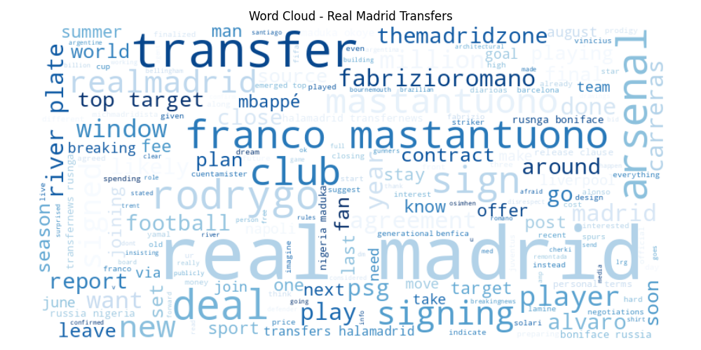
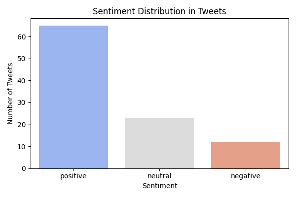
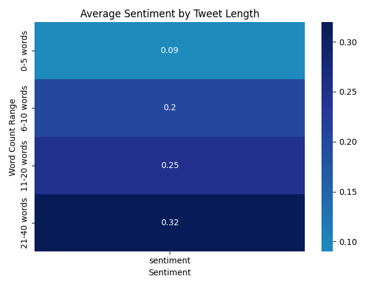

# Sentiment Analysis of Tweets about Real Madrid Transfers on X (Twitter)

## 1. Project Goal

The goal of the project was to conduct a sentiment analysis of tweets about Real Madrid football club and its transfer activity. The project covered the entire analytical process – from acquiring data from the X platform API, through data cleaning and sentiment analysis using the VADER model, to visualizing results and interpreting user sentiments.

## 2. Data Collection Process

The data was retrieved using the official X platform API v2 (`/search/recent`). The query included the most common keywords related to transfers and Real Madrid, limiting the language to English and excluding retweets:

```python
query_params = {
    'query': (
        '(#RealMadrid OR "Real Madrid") '
        '(transfer OR transfers OR sign OR signing OR signed OR deal OR bid OR '
        'rumor OR rumours OR target OR "Huijsen" OR "Trent Alexander-Arnold" OR "Carreras") '
        'lang:en -is:retweet'
    ),
    'max_results': '100',
    'tweet.fields': 'created_at,text,lang,author_id'
}
```

The code responsible for data retrieval is in the `fetch_tweets.py` file. The results were saved in the `tweets.json` file.

## 3. Data Cleaning and Preparation

The data was processed in the `clean_tweets.py` script. Main operations:

- converting text to lowercase,
- removing URLs and punctuation marks,
- tokenization and removing stopwords using `nltk`.

Cleaned texts were saved in the `cleaned_text` column, and the entire dataset to the `tweets_cleaned.json` file.

## 4. Sentiment Analysis

The sentiment analysis was performed in `analyze_sentiment.py` using the VADER model. For each tweet, a `compound` coefficient was calculated, based on which a sentiment class was assigned:

- `positive`: compound ≥ 0.05
- `negative`: compound ≤ -0.05
- `neutral`: others

The results were saved in the `sentiment` and `sentiment_label` columns.

## 5. Visualizations

To better understand the results, four charts were prepared:

### Word Cloud

Visualization of the most frequently occurring words after cleaning tweets.



### Sentiment Class Distribution (Bar Chart)

Shows what portion of tweets were positive, neutral, or negative.


### Sentiment Change Over Time (Line Chart)

Shows the average sentiment level over time, taking into account time windows.



### Sentiment vs. Tweet Length (Heatmap)

Analyzes the relationship between the number of words in a tweet and its average sentiment.



## 6. Conclusions

The analysis showed a predominance of positive sentiment in tweets about Real Madrid transfers. Player names and words related to transfers appeared most frequently. Longer tweets usually had a more positive character, which suggests that users sharing more elaborate opinions expressed greater enthusiasm.
