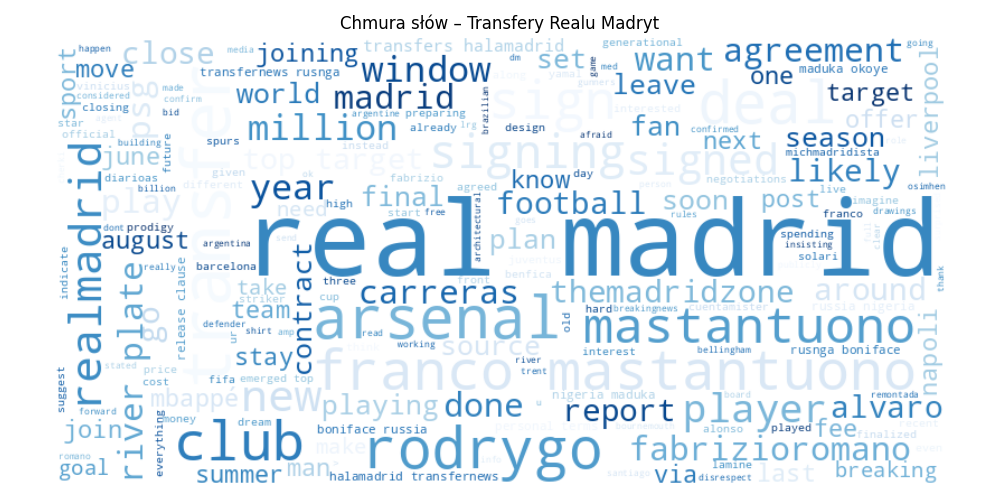

# Analiza sentymentu postów dotyczących transferów Realu Madryt na platformie X (Twitter)

## 1. Cel projektu

Celem projektu było przeprowadzenie analizy sentymentu tweetów dotyczących klubu Real Madryt i jego aktywności transferowej. Projekt obejmował cały proces analityczny – od pozyskiwania danych z API platformy X, przez ich czyszczenie i analizę sentymentu z wykorzystaniem modelu VADER, aż po wizualizację wyników i interpretację nastrojów użytkowników.

## 2. Proces zbierania danych

Dane zostały pobrane przy pomocy oficjalnego API v2 platformy X (`/search/recent`). W zapytaniu uwzględniono najczęstsze słowa kluczowe związane z transferami i Realem Madryt, ograniczając język do angielskiego i wykluczając retweety:

```python
query_params = {
    'query': (
        '(#RealMadrid OR "Real Madrid") '
        '(transfer OR transfers OR sign OR signing OR signed OR deal OR bid OR '
        'rumor OR rumours OR target OR "Huijsen" OR "Trent Alexander-Arnold" OR "Carreras") '
        'lang:en -is:retweet'
    ),
    'max_results': '100',
    'tweet.fields': 'created_at,text,lang,author_id'
}
```

Kod odpowiedzialny za pobieranie danych znajduje się w pliku `fetch_tweets.py`. Wyniki zapisano w pliku `tweets.json`.

## 3. Czyszczenie i przygotowanie danych

Dane zostały przetworzone w skrypcie `clean_tweets.py`. Główne operacje:

* konwersja tekstu do małych liter,
* usunięcie adresów URL i znaków interpunkcyjnych,
* tokenizacja i usuwanie słów pustych (ang. stopwords) z użyciem `nltk`.

Oczyszczone teksty zapisano w kolumnie `cleaned_text`, a cały zbiór do pliku `tweets_cleaned.json`.

## 4. Analiza sentymentu

Analiza nastroju została przeprowadzona w `analyze_sentiment.py` przy użyciu modelu VADER. Dla każdego tweeta obliczono współczynnik `compound`, na podstawie którego przypisano klasę sentymentu:

* `positive`: compound ≥ 0.05
* `negative`: compound ≤ -0.05
* `neutral`: pozostałe

Wyniki zapisano w kolumnach `sentiment` i `sentiment_label`.

## 5. Wizualizacje

W celu lepszego zrozumienia wyników przygotowano cztery wykresy:

### Chmura słów

Wizualizacja najczęściej występujących słów po oczyszczeniu tweetów.



### Rozkład klas sentymentu (Wykres słupkowy)

Pokazuje, jaka część tweetów miała charakter pozytywny, neutralny lub negatywny.


### Zmiana nastroju w czasie (Wykres liniowy)

Pokazuje średni poziom nastroju w czasie, z uwzględnieniem okien czasowych.


### Sentyment a długość tweeta (Heatmapa)

Analizuje zależność między liczbą słów w tweecie a jego średnim sentymentem.


## 6. Wnioski

Analiza wykazała przewagę pozytywnego sentymentu w tweetach dotyczących transferów Realu Madryt. Najczęściej pojawiały się nazwiska zawodników i słowa związane z transferami. Dłuższe tweety zwykle miały bardziej pozytywny charakter, co sugeruje, że użytkownicy dzielący się bardziej rozbudowanymi opiniami wyrażali większy entuzjazm.
